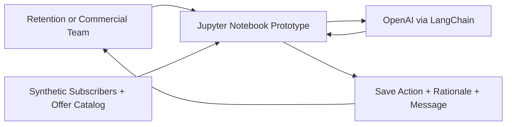
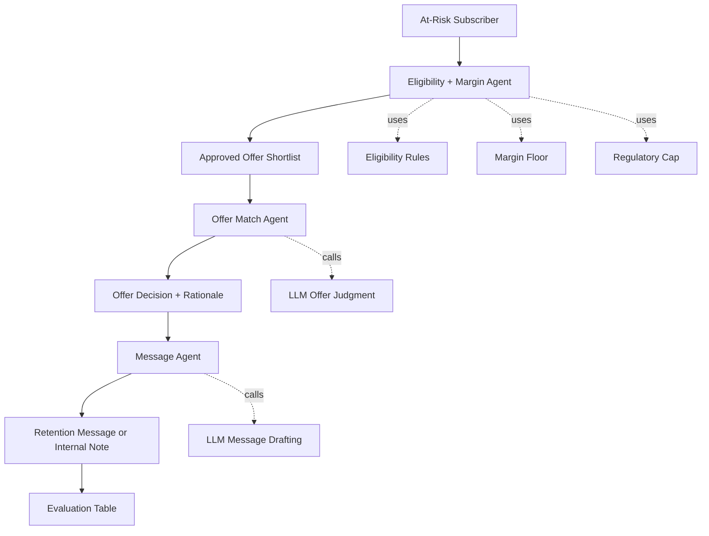

# Architecture

This document describes the current prototype architecture for the telco churn-save workflow. It is intentionally lightweight and reflects what the notebook does today, not a full production target state.

## System Context



At this stage, the system is a notebook-based prototype. It uses synthetic subscriber records and a synthetic approved offer catalog to demonstrate a controlled churn-save decisioning pattern.

## Workflow Architecture



The workflow is orchestrated with LangGraph. Each node has a narrow responsibility and passes its result into the next node.

## Agent Responsibilities

| Component | Responsibility | Current Implementation |
| --- | --- | --- |
| Eligibility + Margin Agent | Filters the offer catalog to actions allowed for the subscriber. | Uses deterministic eligibility, retained-margin, and regulatory-cap checks. |
| Offer Match Agent | Selects the cheapest effective offer from the approved shortlist. | Uses an LLM prompt constrained to approved offer keys, with safe fallback to `NO_OFFER`. |
| Message Agent | Drafts a compliant customer-facing retention message or internal monitoring note. | Uses an LLM prompt grounded in the chosen offer, rationale, risk signals, and regulatory notes. |
| Evaluation Step | Checks whether the workflow respected business guardrails and basic strategy expectations. | Tracks margin-floor violations, low-risk over-discounting, and directional appropriateness. |

## Data Flow

```text
Synthetic subscriber
  -> approved offer catalog
  -> deterministic eligibility and margin scan
  -> approved offer shortlist
  -> bounded offer decision
  -> retention message or internal note
  -> evaluation against prototype quality checks
```

The notebook currently assumes each subscriber already has a churn-risk score and recent behavioral signals. A production-grade system would need upstream churn modeling, signal governance, and integration with customer and campaign systems.

## Decision Outputs

The workflow returns:

- `eligibility_scan`: per-offer eligibility, margin, regulatory status, cost, and blocking reasons
- `approved_offers`: offer keys the LLM is allowed to choose from
- `offer_decision`: selected `offer_key` and rationale
- `message`: customer-facing retention copy or internal monitoring note
- `trace`: workflow breadcrumbs for auditability
- Evaluation metrics for hard guardrails and directional quality

## Current Boundaries

This prototype does not include:

- Real churn model training or calibration
- Live subscriber, billing, CRM, care, or network data
- Campaign execution or contact-channel orchestration
- Treatment fairness, eligibility governance, or consent management
- Human approval queues or manager override workflows
- Persistent audit logging, observability, or model risk controls

Those are documented separately in [future_improvements.md](./future_improvements.md).

## How To Think About This Architecture

When drawing software architecture for agentic AI systems, start with three questions:

1. Who uses the system?
2. What information flows through the system?
3. Which decisions are made by deterministic code, by an LLM, and by a human?

For this project, the important architecture story is not just "there are three agents." The more important story is that deterministic commercial and compliance gates define what is allowed before the LLM applies judgment. The LLM has bounded autonomy: it can choose within the approved offer space, but it cannot override margin, eligibility, or regulatory constraints.
